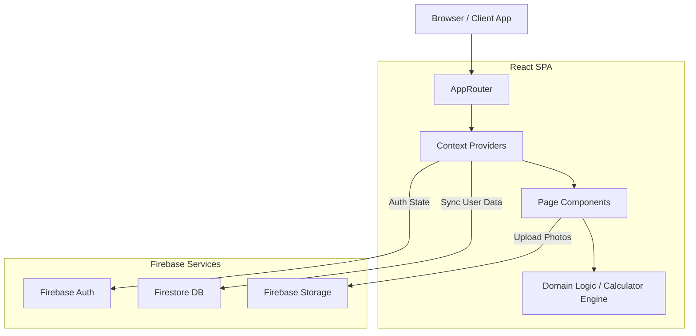

# 1. High-Level Overview & Concept

**DoughLabPro** is a precision baking companion designed for serious home bakers and professionals. It bridges the gap between scientific baking (Baker's Math, fermentation kinetics, temperature control) and the art of pizza and bread making.

Unlike simple recipe apps, DoughLabPro is a **"Digital Dough Lab"**. It doesn't just give you a recipe; it helps you *engineer* your dough based on your specific environment, ingredients, and goals.

### Core Product Areas

1.  **The Calculator (Engine)**: The heart of the app. A professional-grade dough calculator that handles complex preferments (Biga, Poolish, Sourdough), hydration adjustments, and scaling. It supports both "Target Dough Weight" and "Total Flour" modes.
2.  **MyLab (Dashboard)**: The user's personal laboratory. Here, users track their **Bakes** (batches), manage their **Levain (Sourdough Starter)**, log **Sensory Analysis**, and set **Goals**. It serves as a persistent record of their baking journey.
3.  **Styles (Library)**: A curated encyclopedia of dough styles (e.g., Neapolitan, NY Slice, Ciabatta, Brioche). Each style is not just a recipe but a "Technical Profile" that feeds the Calculator with correct parameters (hydration ranges, fermentation times).
4.  **Learn (Academy)**: An educational hub covering the "Why" and "How". It includes deep dives into flour science, fermentation biochemistry, oven management, and troubleshooting.
5.  **Tools (Utilities)**: Specialized tools like the **Oven Profiler** (to analyze oven performance) and **Doughbot** (AI assistant).
6.  **Community (Social)**: A space for users to share their "Bakes", clone recipes from others, and discuss techniques.

---

# 2. Tech Stack & Global Architecture

DoughLabPro is built as a modern Single Page Application (SPA) with a serverless backend.

### Technology Stack
*   **Frontend Framework**: React 19 (via Vite)
*   **Language**: TypeScript (Strict mode)
*   **Styling**: TailwindCSS + Custom Design Tokens (CSS Variables)
*   **State Management**: React Context API + LocalStorage (for persistence)
*   **Backend / BaaS**: Google Firebase
    *   **Auth**: User authentication (Google, Email)
    *   **Firestore**: NoSQL database for syncing user data (Bakes, Levains, Goals)
    *   **Storage**: Image hosting for bake photos
*   **Routing**: `react-router-dom` with lazy loading
*   **Internationalization**: Custom i18n solution

### Architecture Diagram



### Key Architectural Decisions
*   **Offline-First Capability**: The app relies heavily on local calculation logic (`src/logic`). While Firestore is used for syncing, the core Calculator works entirely client-side.
*   **Context-Based State**: Instead of a heavy global store like Redux, the app uses domain-specific Contexts (`UserProvider`, `CalculatorProvider`, `LevainProvider`) to compartmentalize state.
*   **Lazy Loading**: All major routes are lazy-loaded to improve initial load performance.

---

# 3. Repository & Module Topology

The codebase is structured to separate "Domain Logic" from "UI Components" and "Data Persistence".

### Folder Structure

*   **`src/logic/`**: **The Brain.** Contains pure functions for calculations.
    *   `doughMath.ts`: The core Baker's Math engine.
    *   `normalization.ts`: Ensures data consistency.
    *   `methodGenerator.ts`: Generates step-by-step instructions dynamically.
*   **`src/contexts/`**: **The Nervous System.** Manages state and side effects.
    *   `UserProvider.tsx`: Handles Auth, User Profile, and syncs core collections (Ovens, Batches).
    *   `CalculatorContext.tsx`: Manages the calculator's inputs and results.
*   **`src/data/`**: **The Knowledge Base.**
    *   `stylesData.ts`: The massive JSON-like definition of all dough styles.
*   **`src/pages/`**: **The Views.** Grouped by module (`mylab`, `learn`, `styles`, `tools`).
*   **`src/components/`**: **The UI Bricks.** Reusable UI elements (`ui/`) and feature-specific components.
*   **`src/types/`**: **The Contract.** TypeScript definitions ensuring type safety across the app.

---

# 4. Routing & Navigation (Global Map)

The app uses `react-router-dom` defined in `src/AppRouter.tsx`.

### Route Tree

*   **`/` (Root)** -> Redirects to `/mylab` or Landing (if unauth).
*   **`/mylab`** -> **My Lab Dashboard**. The user's home base.
    *   `/mylab/fornadas` (Batches) -> List of past and planned bakes.
    *   `/mylab/levain` -> Levain (Starter) management.
    *   `/mylab/levain/detail/:id` -> Specific Levain profile.
    *   `/mylab/flours` -> User's flour inventory.
    *   `/mylab/goals` -> Baking objectives.
*   **`/calculator`** -> **The Calculator**. The main tool for creating recipes.
*   **`/styles`** -> **Style Library**. Browser for dough styles.
    *   `/styles/detail/:id` -> Deep dive into a specific style (history, specs).
*   **`/learn`** -> **Academy**. Educational content.
    *   `/learn/article/:id` -> Specific learning articles.
    *   `/learn/ingredients/*` -> Ingredient guides.
*   **`/tools`** -> **Utilities**.
    *   `/tools/oven-profiler` -> Oven analysis tool.
    *   `/tools/doughbot` -> AI Assistant.
*   **`/community`** -> **Social Feed**.
*   **`/settings`**, **`/profile`**, **`/plans`**.

---

# 5. Major Modules & UX Flows

### 1. MyLab Module
*   **Purpose**: Central hub for the user's baking life.
*   **Key Pages**: Dashboard, Batches List, Levain Monitor.
*   **UX Flow**: Users typically start here to check the status of their Levain or review their last bake before starting a new one.
*   **Data**: Consumes `UserContext` (Batches, Levains, Goals).

### 2. Calculator Module
*   **Purpose**: Create precision dough formulas.
*   **Key Interactions**:
    *   Select **Style** (e.g., Neapolitan).
    *   Input **Quantity** (e.g., 4 pizzas, 250g each).
    *   Adjust **Parameters** (Hydration, Salt %, Fermentation).
    *   **Result**: See exact gram weights for Flour, Water, Salt, Yeast/Starter.
*   **Data**: Consumes `CalculatorContext`, `StylesData`.

### 3. Styles Module
*   **Purpose**: Encyclopedia of dough types.
*   **Content Strategy**: 30 Core Styles available at launch, plus 5 new "Seasonal/Pro" styles released monthly for the first 3 months (Total 45 styles).
*   **Key Interactions**: Browse styles by category (Pizza, Bread). View "Technical Profile" (ideal hydration, oven temp). "Use in Calculator" button transfers style data to the Calculator.

### 4. Learn Module
*   **Purpose**: Education.
*   **Key Interactions**: Read articles. Contextual links from Calculator (e.g., "Why is hydration important?") lead here.

### **UX Flow Example: The "Perfect Pizza" Journey**
1.  **Discovery**: User goes to **Styles**, browses "Neapolitan", reads about its history and technical specs.
2.  **Action**: Clicks "Use in Calculator".
3.  **Calculation**: App navigates to **Calculator**, pre-filling Neapolitan defaults (60% hydration, 3% salt). User adjusts for 6 pizzas.
4.  **Execution**: User reviews the recipe, clicks "Start Bake".
5.  **Tracking**: App creates a **Batch** in **MyLab**. User logs the process.
6.  **Reflection**: After baking, user rates the batch in **MyLab** and adds notes for next time.

---

# 6. Calculator Deep-Dive (Logic, Formulas & Correlations)

The Calculator is the core IP of DoughLabPro. It is defined in `src/logic/doughMath.ts` and managed by `src/contexts/CalculatorContext.tsx`.

### 1. User Inputs & Parameters
*   **Bake Type**: Pizza, Bread, Pastry.
*   **Style Preset**: Loads defaults from `DoughStylePreset`.
*   **Quantity Mode**:
    *   **By Dough Weight**: "I want 4 balls of 250g".
    *   **By Total Flour**: "I have 1kg of flour, what can I make?".
*   **Core Parameters**:
    *   **Hydration %**: Water weight / Flour weight.
    *   **Salt %**: Salt weight / Flour weight.
    *   **Fat/Oil %**: Fat weight / Flour weight.
    *   **Sugar %**: Sugar weight / Flour weight.
*   **Fermentation Settings**:
    *   **Method**: Direct, Poolish, Biga, Sourdough.
    *   **Preferment %**: How much of the total flour is pre-fermented.

### 2. Core Logic & Formulas (`doughMath.ts`)
The calculator uses **Baker's Percentage** where Total Flour is always 100%.

**Step 1: Calculate Total Target Weight**
*   `TotalWeight = NumBalls * BallWeight * ScaleFactor`

**Step 2: Calculate "Total Percentage Factor"**
*   `Factor = 100 (Flour) + Hydration + Salt + Fat + Sugar + Yeast`
*   *Example*: 100 + 65 + 3 + 0 + 0 + 0.5 = 168.5%

**Step 3: Solve for Total Flour**
*   `TotalFlour = TotalWeight * (100 / Factor)`

**Step 4: Solve for Ingredients**
*   `Water = TotalFlour * (Hydration / 100)`
*   `Salt = TotalFlour * (Salt / 100)`
*   ...and so on.

**Step 5: Pre-ferment Decomposition (Advanced)**
If a preferment (Biga/Poolish/Levain) is selected:
1.  Calculate **Preferment Flour** = `TotalFlour * Preferment%`.
2.  Calculate **Preferment Water** based on its specific hydration (Poolish=100%, Biga=50%, Levain=UserDefined).
3.  **Subtract** these amounts from the "Final Dough" mix to ensure the *total* formula remains balanced.

### 3. Correlations
*   **Styles**: The `DoughStyleDefinition` (in `stylesData.ts`) defines the *ranges* and *defaults* for these parameters. When a user selects a style, these values are injected into the Calculator Context.
*   **MyLab**: When a user "Starts a Bake", the current `DoughConfig` and `DoughResult` are serialized and saved as a `Batch` object in Firestore.
*   **Levain**: If "Sourdough" is selected, the calculator pulls the user's active **Levain** profile (specifically its hydration) to adjust the water calculation accurately.

---

# 7. Data Models, Persistence & Relationships

Data models are defined in `src/types/index.ts`.

### Core Entities

1.  **User (`User`)**
    *   **Fields**: `uid`, `email`, `plan` ('free'|'lab_pro'), `ovens` (Array).
    *   **Storage**: `users/{uid}` document in Firestore.

2.  **Batch (`Batch`)**
    *   **Concept**: A record of a single baking session.
    *   **Fields**: `id`, `doughConfig` (Snapshot of calculator settings), `doughResult` (Snapshot of weights), `status` (Draft, Planned, Completed), `rating`, `notes`.
    *   **Storage**: `users/{uid}/batches` collection.
    *   **Relationship**: Belongs to User. Can reference a Style ID.

3.  **Levain (`Levain`)**
    *   **Concept**: A sourdough starter profile.
    *   **Fields**: `id`, `name`, `hydration`, `feedingHistory` (Array of events).
    *   **Storage**: `users/{uid}/levains` collection.

4.  **Dough Style (`DoughStyleDefinition`)**
    *   **Concept**: A static definition of a type of dough.
    *   **Fields**: `id`, `technicalProfile` (ranges for hydration, temp), `history`, `origin`.
    *   **Storage**: Hardcoded in `src/data/stylesData.ts` (Read-only).

5.  **Goal (`Goal`)**
    *   **Concept**: A user objective (e.g., "Master High Hydration").
    *   **Storage**: `users/{uid}/goals` collection.

---

# 8. State Management & Side Effects

### Context Architecture
*   **`UserProvider`**: The "God Context". It subscribes to Firestore collections (`onSnapshot`) and keeps local state (`batches`, `ovens`, `levains`) in sync in real-time. It handles all writes to Firestore.
*   **`CalculatorContext`**: Manages the transient state of the calculator form. It does *not* persist to DB until the user explicitly "Saves" or "Starts Bake". It handles validation logic (`useEffect` hooks checking bounds).

### Side Effects
*   **Firestore Sync**: `UserProvider` sets up listeners on mount. Changes in DB reflect immediately in UI.
*   **Auth**: `AuthContext` listens to Firebase Auth state changes.
*   **Analytics**: Actions like "Create Batch" trigger `logEvent` calls.

---

# 9. Roles, Permissions, Plans & Paywall Logic

Permissions are central to the business model, defined in `src/permissions.ts`.

### Plans
1.  **Free**: Basic access. Limited styles (3 Picks).
2.  **Calculator Unlock**: Access to all calculator features but limited MyLab.
3.  **Lab Pro**: Full access to all 30 Launch Styles and monthly content drops (5/month for 3 months).

### Paywall Logic
*   **Feature Flags**: The `RequireFeature` component checks if the user's plan allows a specific `FeatureKey` (e.g., `mylab.unlimited_advanced`).
*   **Guards**: `AppRouter` wraps protected routes with `protectWithFeature`.
*   **Triggers**: If a user tries to access a locked feature (e.g., add a 2nd Levain), `openPaywall()` is called from `UserContext`, displaying the `PaywallModal`.

---

# 10. UI/UX System & Design Language

*   **Design System**: Implemented via TailwindCSS utility classes and CSS variables (`src/index.css`) for theming (colors, fonts).
*   **Components**: Atomic design in `src/components/ui` (Buttons, Cards, Inputs).
*   **Layouts**:
    *   **Navigation**: Bottom tab bar on mobile, Sidebar/Header on desktop.
    *   **Responsive**: Mobile-first approach. Complex tables (Calculator) adapt to stacked cards on small screens.

---

# 11. Integrations & External Services

1.  **Firebase Auth**: Identity management.
2.  **Firebase Firestore**: NoSQL Database.
3.  **Firebase Storage**: Storing user-uploaded photos of bakes.
4.  **Google Generative AI (Gemini)**: Used in `src/ai` (likely for Doughbot or recipe generation).
5.  **Stripe** (Implied): `stripeCustomerId` field in User model suggests billing integration.

---

# 12. Analytics, Events & Telemetry

*   **Service**: `src/services/analytics.ts`.
*   **Events**:
    *   `batch_created`: When a user starts a bake.
    *   `levain_pet_feeding_logged`: When a user feeds their starter.
    *   `paywall_viewed`: When the paywall is triggered.

---

# 13. Error Handling, Logging & Observability

*   **UI Boundaries**: `ErrorBoundary` component wraps the main router to catch React render errors.
*   **Form Validation**: `CalculatorContext` maintains an `errors` object for invalid inputs (e.g., hydration > 120%), displaying toasts via `ToastProvider`.
*   **Async Errors**: `UserProvider` catches Firestore errors and logs them to console (and potentially toast).

---

# 14. Performance & Optimization

*   **Code Splitting**: Extensive use of `React.lazy` in `AppRouter.tsx` ensures that heavy pages (like Learn articles or specialized Tools) are not loaded in the initial bundle.
*   **Memoization**: `useMemo` is used heavily in `CalculatorContext` to prevent re-running the expensive `calculateDoughUniversal` function on every render.
*   **Optimistic Updates**: Some UI interactions update local state immediately while the Firestore write happens in the background.

---

# 15. Security, Auth & Access Control Flows

*   **Authentication**: Handled by `AuthContext`. Supports Google Sign-In.
*   **Route Protection**: `RequireAuth` component blocks unauthenticated access to private routes (`/mylab`, `/profile`).
*   **Data Security**: Firestore Security Rules (`firestore.rules`) enforce that users can only read/write documents where `request.auth.uid == userId`.

---

# 16. Testing & QA Strategy

*   **Type Safety**: TypeScript is the primary line of defense.
*   **Manual Testing**: The codebase includes a `TESTING_CHECKLIST.md` implying a manual QA process.
*   **Unit Tests**: (Not explicitly seen in file list, but structure allows for Jest/Vitest testing of `src/logic`).

---

# 17. Build, Deployment & CI/CD

*   **Build Tool**: Vite (`vite build`) produces a highly optimized production bundle in `dist/`.
*   **Deployment**: Configured for Vercel or similar static hosting (SPA mode).
*   **Linting**: ESLint and TypeScript compiler (`tsc`) checks.

---

# 18. Configuration & Environments

*   **Environment Variables**: `.env` files manage Firebase config keys and API endpoints.
*   **Constants**: `src/constants.ts` holds app-wide constants (Default Config, Limits).

---

# 19. Cross-Module Relationship Graphs & End-to-End Journeys

### Relationship Graph

```
[Styles Module] --(Provides Defaults)--> [Calculator Context]
                                                |
                                                v
                                         [Calculator Engine]
                                                |
                                                v
                                         [Dough Result]
                                                |
[User Context] --(Saves Result)--> [MyLab / Batches]
      ^                                         |
      |                                         v
[Auth & Permissions] --(Controls Access)--> [Features]
```

### End-to-End Journey: The "Sourdough Weekend"
1.  **Friday Night**: User opens app, goes to **MyLab > Levain**. Checks "Levain Pet" status. It says "Hungry". User logs a feeding.
2.  **Saturday Morning**: User goes to **Calculator**. Selects "Country Sourdough" style.
3.  **Correlation**: Calculator detects "Sourdough" yeast type. It asks which Levain to use. User selects their active Levain. Calculator adjusts water amount based on Levain's hydration.
4.  **Planning**: User calculates for 2 loaves. Clicks "Start Bake".
5.  **Process**: App redirects to **MyLab > Batch Detail**. User checks off "Autolyse", "Mix", "Fold" steps as they happen.
6.  **Sunday Morning**: User bakes. Takes a photo. Uploads it to the Batch record.
7.  **Result**: User marks batch as "Completed". The app updates the "Total Bakes" counter in their Profile.

---

# 20. Known Limitations, Risks & Tech Debt

*   **Offline Sync**: While Firestore has offline support, the app's explicit dependency on online fetching for some features might be a limitation in poor connectivity.
*   **Complex State**: `UserProvider` is becoming very large ("God Object"). It might need splitting into smaller providers (which is partially done with `LevainProvider`, etc., but `UserProvider` still holds a lot).
*   **Hardcoded Styles**: Styles are in a file, not DB. Updating styles requires a code deployment.

---

# 21. Glossary of Domain Terms

*   **Hydration**: The ratio of water to flour by weight.
*   **Levain**: A natural sourdough starter culture.
*   **Poolish**: A liquid commercial yeast preferment (100% hydration).
*   **Biga**: A stiff commercial yeast preferment (50% hydration).
*   **Baker's Percentage**: A method where flour is always 100%, and other ingredients are a percentage of the flour weight.
*   **W (Strength)**: A measure of flour strength (protein content/quality).
*   **Cornicione**: The raised rim of a pizza.

---

# 22. JSON Summary for LLMs

```json
{
  "appName": "DoughLabPro",
  "techStack": {
    "frontend": "React 19, Vite, TailwindCSS",
    "backend": "Firebase (Auth, Firestore, Storage)",
    "language": "TypeScript"
  },
  "modules": [
    "Calculator",
    "MyLab (Dashboard)",
    "Styles (Library)",
    "Learn (Education)",
    "Tools",
    "Community"
  ],
  "coreLogic": {
    "engine": "src/logic/doughMath.ts",
    "method": "Baker's Percentage",
    "capabilities": ["Direct", "Poolish", "Biga", "Sourdough", "Scaling"]
  },
  "dataModels": [
    "User",
    "Batch (Bake)",
    "Levain (Starter)",
    "DoughStyleDefinition",
    "Goal"
  ],
  "keyFlows": [
    "Style Selection -> Calculation -> Batch Creation -> Tracking",
    "Levain Feeding -> Sourdough Calculation Adjustment"
  ]
}
```
