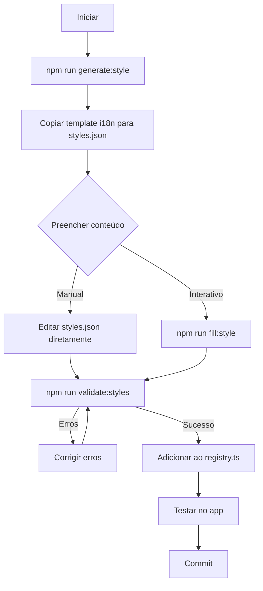

# 📚 Documentação do Sistema de Estilos

Bem-vindo ao sistema de definição de estilos do DoughLabPro! Este sistema fornece uma estrutura padronizada e completa para criar, gerenciar e validar estilos de massa.

## 🎯 Visão Geral

O sistema de estilos permite que você:
- ✅ Crie novos estilos com estrutura padronizada
- ✅ Garanta completude de todos os campos obrigatórios
- ✅ Mantenha consistência de i18n
- ✅ Valide definições automaticamente
- ✅ Preencha conteúdo de forma interativa

## 📖 Documentação Disponível

### Para Começar Rapidamente
📄 **[GUIA_ESTILOS.md](./GUIA_ESTILOS.md)** - Guia rápido em português
- Como criar um novo estilo em 3 passos
- Comandos essenciais
- Exemplos práticos
- Problemas comuns e soluções

### Para Entender o Sistema
📄 **[STYLE_SYSTEM.md](./STYLE_SYSTEM.md)** - Documentação completa
- Estrutura do schema detalhada
- Campos obrigatórios vs opcionais
- Boas práticas
- Workflow completo
- Troubleshooting avançado

### Para Preencher Conteúdo
📄 **[STYLE_CHECKLIST.md](./STYLE_CHECKLIST.md)** - Checklist de preenchimento
- Lista completa de todos os campos
- Contadores de progresso
- Dicas de eficiência
- Critérios de qualidade
- Templates de conteúdo

## 🚀 Quick Start

### 1. Criar Novo Estilo
```bash
npm run generate:style
```

### 2. Preencher Conteúdo
```bash
npm run fill:style -- nome_do_estilo
```

### 3. Validar
```bash
npm run validate:styles
```

## 🛠️ Scripts Disponíveis

| Comando | Descrição |
|---------|-----------|
| `npm run generate:style` | Cria estrutura de novo estilo interativamente |
| `npm run fill:style -- <id>` | Ajuda a preencher TODOs interativamente |
| `npm run validate:styles` | Valida todos os estilos |

## 📁 Estrutura de Arquivos

```
doughlabpro/
├── docs/
│   ├── README.md                 # Este arquivo
│   ├── GUIA_ESTILOS.md          # Guia rápido (PT)
│   ├── STYLE_SYSTEM.md          # Documentação completa (EN)
│   └── STYLE_CHECKLIST.md       # Checklist de preenchimento
│
├── scripts/
│   ├── generate-style.js        # Gerador de estilos
│   ├── fill-style-content.js    # Preenchedor interativo
│   └── validate-styles.ts       # Validador
│
├── src/
│   ├── data/styles/
│   │   ├── bread/               # Estilos de pão
│   │   ├── pizza/               # Estilos de pizza
│   │   ├── pastry/              # Estilos de massa doce
│   │   ├── registry.ts          # Registro central
│   │   └── builder.ts           # Helper de construção
│   │
│   └── types/
│       └── styleDefinition.ts   # Schema TypeScript
│
└── public/locales/en/
    └── styles.json              # Traduções
```

## 🎨 Workflow Recomendado



## 📊 Estatísticas

Um estilo completo contém aproximadamente:
- **100+ campos** de conteúdo
- **6 seções** principais
- **3-5 FAQs**
- **1+ referências**
- **Tempo de preenchimento**: 1-4 horas (dependendo da pesquisa)

## ✅ Critérios de Qualidade

Um estilo está pronto para produção quando:
- ✅ Passa na validação (`npm run validate:styles`)
- ✅ Não contém marcadores `[TODO]`
- ✅ Tem conteúdo específico e educacional
- ✅ Cita fontes confiáveis
- ✅ FAQ responde perguntas relevantes
- ✅ Renderiza corretamente no app
- ✅ Está registrado em `registry.ts`

## 🎓 Exemplos de Referência

Estilos completamente preenchidos para usar como referência:
- `src/data/styles/pizza/california_style.ts`
- `src/data/styles/pizza/detroit_style_classic.ts`
- `src/data/styles/bread/sourdough_classic.ts` (se existir)

## 🆘 Precisa de Ajuda?

1. **Guia Rápido**: Leia [GUIA_ESTILOS.md](./GUIA_ESTILOS.md)
2. **Documentação Completa**: Consulte [STYLE_SYSTEM.md](./STYLE_SYSTEM.md)
3. **Checklist**: Use [STYLE_CHECKLIST.md](./STYLE_CHECKLIST.md)
4. **Schema**: Veja `src/types/styleDefinition.ts`
5. **Exemplos**: Explore estilos existentes em `src/data/styles/`

## 🤝 Contribuindo

Ao adicionar novos estilos:
1. Use sempre o gerador (`npm run generate:style`)
2. Pesquise fontes confiáveis
3. Preencha TODO o conteúdo
4. Valide antes de commitar
5. Teste no app
6. Documente fontes nas referências

## 📝 Notas Importantes

- **Nunca** deixe marcadores `[TODO]` em produção
- **Sempre** cite suas fontes
- **Valide** antes de cada commit
- **Teste** no app após criar/editar
- **Seja específico** - evite descrições genéricas

## 🔗 Links Úteis

- [TypeScript StyleDefinition Schema](../src/types/styleDefinition.ts)
- [Style Registry](../src/data/styles/registry.ts)
- [i18n Styles](../public/locales/en/styles.json)

---

**Pronto para criar seu primeiro estilo?** 

Execute `npm run generate:style` e siga o [Guia Rápido](./GUIA_ESTILOS.md)! 🚀
