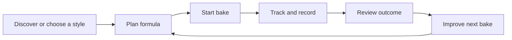

# DoughLab Pro UI/UX Redesign Plan

## Why this plan exists

DoughLab Pro already has strong feature breadth, but the product experience still feels assembled instead of designed.
Today the app mixes multiple visual languages, multiple page archetypes, multiple naming systems, and multiple navigation models.
The result is a product that can feel:

- visually inconsistent
- harder to understand than it should be
- less premium than the functionality deserves
- more complex than the user’s actual job

This plan defines one coherent UI/UX direction for the whole app so the product stops feeling like a patchwork shell.

---

## Current diagnosis

### 1. The product has no single UX story

The app currently behaves like several products glued together:

- a calculator
- a baking lab / CRM
- a learning library
- a style encyclopedia
- a tools suite
- a community product
- a subscription app

Each area works, but the handoff between them is not clear enough.
The user is often asked to navigate the product structure instead of being guided through a baking workflow.

### 2. The interface uses more than one visual language

Examples visible in the codebase:

- glass / translucent cards in some places
- flat gray SaaS cards in others
- gradient marketing panels on landing pages
- different button personalities between `landing`, `plans`, `upgrade`, `calculator`, `mylab`
- headings and card hierarchies that do not follow one repeated rhythm

Relevant files:

- [src/index.css](/C:/Antigravity/doughlabpro/src/index.css)
- [tailwind.config.js](/C:/Antigravity/doughlabpro/tailwind.config.js)
- [src/components/marketing/PublicLandingPage.tsx](/C:/Antigravity/doughlabpro/src/components/marketing/PublicLandingPage.tsx)
- [src/components/layout/Navigation.tsx](/C:/Antigravity/doughlabpro/src/components/layout/Navigation.tsx)

### 3. Navigation is wide, not guided

The top nav exposes many major sections at once:

- Calculator
- My Lab
- Styles
- Learn
- Tools
- Community

That is too much top-level choice for a product that should feel focused.
The app should organize around user intent, not around internal modules.

### 4. Names, labels, and mental models drift

The product uses overlapping concepts:

- `My Lab`, `Lab`, `Bakes`, `Recipes`, `Massas`, `Receitas`
- `Styles`, `Style Guide`, `Library`
- `Learn`, `References`, `Chemistry`, `Ingredients`, `Techniques`
- `Upgrade`, `Plans`, `Pro`, `Unlock Pro`

This makes the product feel less trustworthy because the vocabulary is unstable.

### 5. Page templates are not standardized

The app needs a small set of recurring page shells, but today each page often reinvents:

- hero spacing
- card layout
- call-to-action placement
- page header structure
- empty states
- side notes / hints / upsell blocks

That increases cognitive load and makes the product feel improvised.

### 6. The app optimizes for access to features, not for completion of jobs

The user’s real workflow is closer to:

1. decide what to bake
2. calculate the formula
3. save / track the bake
4. review the result
5. improve the next bake

The current app structure does not consistently reinforce that loop.

---

## North-star product experience

DoughLab Pro should feel like:

- a serious craft tool
- clear enough for beginners
- precise enough for obsessive bakers
- structured like a workshop, not like a dashboard zoo

### Product promise

Turn baking intuition into repeatable results.

### Core UX promise

Every screen should help the user do one of four things:

- plan a bake
- execute and track a bake
- learn how to improve a bake
- manage a personal baking system

If a screen does not clearly belong to one of those jobs, it should be reworked or removed.

---

## Recommended experience model

The app should be organized around one primary loop:

### New primary experience pillars

Use these as the product backbone:

1. Bake
This is the execution path.
Calculator, active bake, timing, dough plan, save batch.

2. Lab
This is the memory and improvement path.
Batches, levain, comparisons, insights, goals, consistency.

3. Library
This is the knowledge path.
Learn content, styles, ingredients, techniques, references.

4. Community
This is the social inspiration path.
Posts, examples, creators, shared bakes.

5. Pro
This is the commercial path.
Plans, upgrade, billing, pro features, value comparison.

This is more coherent than the current top-level split.

---

## Information architecture proposal

### Top navigation

Reduce top-level items to:

- `Bake`
- `Lab`
- `Library`
- `Community`
- `Pro`

Move `Tools` and `Styles` out of top-level navigation.

### Where current sections should go

- `Calculator` -> `Bake`
- `My Lab` -> `Lab`
- `Styles` -> `Library > Styles`
- `Learn` -> `Library > Learn`
- `Tools` -> split by purpose
  - baking utilities -> `Bake`
  - reference utilities -> `Library`
  - niche pro utilities -> contextual entry, not primary nav
- `Upgrade / Plans / Billing` -> `Pro`

### Secondary navigation rules

Every top-level area gets one local subnav with stable structure.

Example:

- `Bake`
  - New Bake
  - Saved Drafts
  - Active Timeline
  - Oven Analysis

- `Lab`
  - Batches
  - Levain
  - Insights
  - Comparisons
  - Goals

- `Library`
  - Styles
  - Fundamentals
  - Ingredients
  - Techniques
  - Science
  - References

This removes the current feeling that every screen is a one-off route.

---

## Visual design direction

## Recommended visual concept

### Direction name

Precision Craft Lab

### Character

- clean
- editorial
- tactile
- premium
- calm
- technical without looking cold

### Design decision

Stop mixing:

- glassmorphism
- gradient marketing surfaces
- generic SaaS cards
- random accent treatments

Choose one dominant style:

- matte light surfaces
- one strong brand green
- one warm highlight color
- restrained shadows
- large, deliberate typography
- highly structured spacing

### Visual rules

- backgrounds should be quiet, not decorative by default
- only hero zones get atmospheric gradients
- cards should use one radius system and one elevation scale
- page sections should breathe more
- emphasis should come from hierarchy, not from many colors

---

## Design system plan

### 1. Token system

Consolidate all tokens into one source of truth.

Needed token groups:

- colors
- typography
- spacing
- radius
- shadow
- border
- motion
- layout widths

Current token ownership is split between:

- [src/index.css](/C:/Antigravity/doughlabpro/src/index.css)
- [tailwind.config.js](/C:/Antigravity/doughlabpro/tailwind.config.js)

That should become one intentional system instead of a gradual accumulation.

### 2. Typography

Use typography to create structure, not decoration.

Recommended:

- display / page headings: `Outfit`
- UI/body: `Inter`

But define explicit scales:

- Display XL
- Display L
- Section Heading
- Page Title
- Card Title
- Body L
- Body M
- Caption
- Label

### 3. Surface system

Create only 4 approved surface types:

- `page`
- `panel`
- `card`
- `highlight`

Ban ad-hoc card styles after that.

### 4. Button system

Define only these button families:

- Primary
- Secondary
- Tertiary
- Destructive
- Upgrade / premium CTA

Every button in the app should map to one of these.

### 5. Page primitives

Create reusable primitives for:

- `AppPageShell`
- `PageHeader`
- `SectionBlock`
- `StatCard`
- `ActionCard`
- `EmptyState`
- `InlineNotice`
- `UpgradeCallout`
- `FilterBar`
- `StickyActionBar`

This is one of the biggest steps to stop the patchwork feeling.

---

## UX clarity plan

### 1. One vocabulary system

Choose one term for each concept and use it everywhere.

Recommended vocabulary:

- `Bake`
  Use for a tracked real production record.
- `Formula`
  Use for the calculator result / dough setup.
- `Lab`
  Use for personal history, tracking, insight, levain, experiments.
- `Library`
  Use for learning and references.
- `Style`
  Use for dough type / category.
- `Pro`
  Use for the paid tier.

### 2. One page-header formula

Every page should answer 3 questions immediately:

- Where am I?
- What is this page for?
- What should I do next?

Each page header should therefore contain:

- page title
- one-sentence purpose
- primary action
- optional secondary action

### 3. One empty-state model

Every empty state should include:

- plain-language explanation
- why it matters
- first action
- optional example / suggestion

### 4. One upsell model

Upsell should stop appearing as isolated paywall friction.
It should follow one pattern:

- value reminder
- concrete unlocked outcome
- one CTA

No more scattered “PRO” noise without context.

---

## Page template system

The app should use a small number of page archetypes.

### Template A: Workspace page

Used for:

- Calculator / Bake
- Batch detail
- Oven analysis
- Compare recipes

Structure:

- page header
- main work area
- supporting right rail or stacked assist section
- sticky action footer on long forms

### Template B: Collection page

Used for:

- Batches
- Styles
- Learn category pages
- Community feed

Structure:

- header
- filters
- featured row or summary
- results grid/list
- empty state

### Template C: Detail page

Used for:

- Style detail
- Learn article
- Community post
- Levain detail

Structure:

- breadcrumb
- hero / title block
- core content
- contextual actions
- related content

### Template D: Conversion page

Used for:

- Landing
- Plans
- Upgrade
- Pro activated

Structure:

- clear promise
- proof
- value comparison
- one primary CTA

No business-critical page should invent its own structure outside these templates.

---

## Navigation and flow redesign

## Primary flows to redesign first

### Flow 1: First-time visitor

Target outcome:

- understand what DoughLab does
- try value quickly
- understand free vs pro
- sign in only when ready

Needed improvements:

- landing should explain product in one clear narrative
- CTA hierarchy should be tighter
- “explore” and “start free” should not compete equally

### Flow 2: First bake

Target outcome:

- choose style
- configure formula
- start bake
- save record

Needed improvements:

- calculator needs a stronger guided mode
- “start batch” should feel like the natural next step
- draft/save naming must be clearer

### Flow 3: Return user

Target outcome:

- immediately see what needs attention
- resume or review a bake
- see progress over time

Needed improvements:

- Lab home should be the real command center
- next actions, reminders, active levain, last bake, and suggestions should be the default

### Flow 4: Learn-to-action

Target outcome:

- read a concept
- apply it to the calculator or the next bake

Needed improvements:

- articles should include contextual “apply this” actions
- styles, ingredients, and science pages should not feel isolated

### Flow 5: Upgrade

Target outcome:

- understand why Pro matters
- buy without friction
- return to the right place afterward

Needed improvements:

- unify pricing copy
- unify upgrade language
- connect upsell to concrete user outcomes

---

## Accessibility plan

The redesign must be accessibility-first, not accessibility-later.

### Standards

- WCAG 2.2 AA baseline
- keyboard complete for core product flows
- visible focus on all interactive surfaces
- semantic headings on every page
- `aria-live` only where appropriate
- no important action hidden behind hover only

### Specific current risks to review

- inconsistent focus treatments
- small muted text in cards and helper labels
- low-priority copy overused in crucial states
- icon-first navigation needing stronger labels
- mobile menu clarity and tap target consistency

---

## Content and microcopy plan

### Voice

DoughLab should sound:

- precise
- calm
- helpful
- non-judgmental
- craft-oriented

Avoid sounding:

- generic SaaS
- overhyped marketing
- technical for the sake of technical

### Copy principles

- lead with user outcome
- prefer plain language first, technical detail second
- use consistent nouns
- avoid duplicate labels for the same action

### PT/EN consistency

The app currently mixes English-first and Portuguese legacy paths / labels.
This redesign should standardize:

- route names
- nav labels
- page titles
- empty states
- upgrade and billing language

---

## Recommended visual hierarchy for key areas

### Bake

This should feel like the flagship workspace.

Priority order:

- current dough setup
- main result
- next action
- advanced controls
- contextual education

### Lab

This should feel like a personal operating system.

Priority order:

- next actions
- active or recent bakes
- levain status
- progress / insight cards
- historical tools

### Library

This should feel editorial and navigable.

Priority order:

- topic orientation
- structured browsing
- reading clarity
- apply-in-app actions

### Community

This should feel less like a disconnected feed and more like shared proof.

Priority order:

- useful inspiration
- credibility of post
- formula context
- actions to clone, save, or learn from it

---

## Execution roadmap

## Phase 1: Product foundation

Goal:
Define the system before rewriting many pages.

Deliverables:

- final UX architecture
- navigation map
- page template set
- vocabulary system
- design token cleanup plan
- component inventory

### Success criteria

- every screen assigned to one product pillar
- every screen mapped to one template
- every top-level label approved

## Phase 2: Design system and shell

Goal:
Unify the chrome and the primitives.

Deliverables:

- new app shell
- new navigation
- new page header
- new section blocks
- new card system
- standardized buttons and notices

### Success criteria

- product already feels coherent before page-level redesign

## Phase 3: Core flow redesign

Goal:
Redesign the most important end-to-end journeys.

Priority order:

1. Bake / Calculator
2. My Lab home
3. Batches / batch detail
4. Upgrade / plans
5. Learn to action

### Success criteria

- first bake flow feels guided
- return user sees one clear next action
- upgrade path feels integrated instead of intrusive

## Phase 4: Content and expansion areas

Goal:
Bring Library, Community, and secondary tools into the same system.

Deliverables:

- article template
- category template
- style detail template
- community feed and post template
- tool entry rationalization

## Phase 5: Polish and proof

Goal:
Make the product feel premium and intentional.

Deliverables:

- motion pass
- accessibility pass
- microcopy pass
- mobile pass
- consistency QA across the full route map

---

## Engineering implications

To make this redesign sustainable, implementation should follow these rules:

- do not redesign page by page in isolation
- build primitives before reworking dozens of screens
- refactor route structure together with nav structure
- use one shared shell and one shared page-header pattern
- centralize tokens and surface styles
- forbid ad-hoc card and button variants

### Technical work likely needed

- create an `app-shell` layer
- create standardized layout primitives
- consolidate UI components under a clearer design-system structure
- move toward route metadata for page titles, descriptions, actions, breadcrumbs
- reduce per-page styling improvisation

---

## KPIs for redesign success

This redesign should improve:

- time to first successful bake
- save-to-bake conversion
- return usage of My Lab
- Learn-to-calculator clickthrough
- upgrade conversion from contextual upsell
- lower navigation confusion in user testing

### Qualitative indicators

Users should start saying:

- “I know where to go”
- “This feels like one product”
- “The app guides me”
- “It looks premium and intentional”

Not:

- “Where do I do this?”
- “Why is this here?”
- “This screen looks different from the others”

---

## Recommended order of actual redesign work

1. Finalize UX architecture and vocabulary.
2. Redesign the app shell and navigation.
3. Build the new page primitives.
4. Redesign `Bake` and `Lab` first.
5. Redesign `Plans / Upgrade`.
6. Redesign `Library`.
7. Redesign `Community`.
8. Run full consistency and accessibility pass.

---

## Practical next step

The next concrete deliverable should not be code yet.
It should be a UI/UX blueprint package with:

- sitemap
- navigation tree
- page template library
- component inventory
- visual direction board
- redesign priorities by route

After that, implementation can happen with much less waste.
